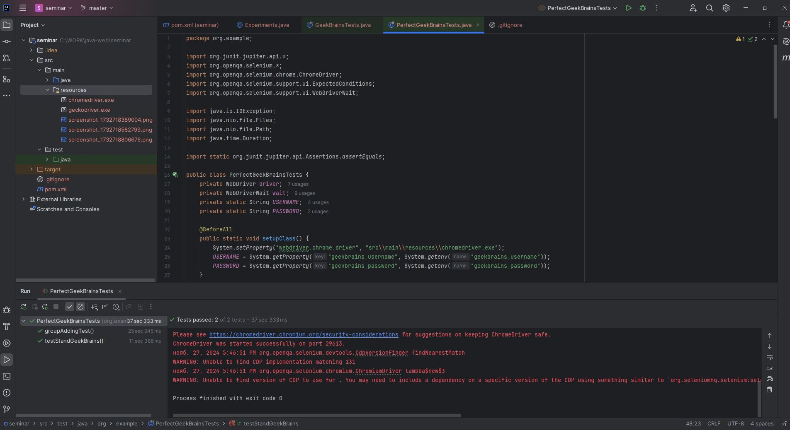

# Семинар: Selenide
## Задание 1.
Перевести на Selenide весь проект с семинара

Условие:
Полностью сделать из Selenium проекта - Selenide проект:
Перевести все классы: кастомные элементы и оставшуюся страницу, небольшие изменения в классе с тестами
Использовать SelenideElement
Ожидания только из Selenide
Инстанцирование классов Page Objects из Selenide
Полностью заменить Selenium код
По итогу станет возможным удалить зависимость на Selenium из pom.xml.

# Семинар: Паттерны проектирования в автоматизации UI
## Задание 1.
Написать два теста - проверка ошибки на Login Page и на таблице студентов с реализацией
нового кастомного элемента

Условие:
Написать два дополнительных теста
Логин в систему не вводя ни логин, ни пароль. На странице появляется ошибка, нужно проверить её текст
Более сложный тест на изменение количества студентов в созданной группе. В этом тесте потребуется
реализовать строки другой таблицы используя паттерн Elements.
Сценарий теста:
- Добавляем студентов в группу с помощью иконки ‘+’ в строке таблицы (клик + обработка модального окна)
- Проверить, что цифра отражающая количество студентов поменялась
- Клик на иконку увеличения - появляется таблица студентов в группе
- Проверяем количество студентов
- Кликаем на иконку корзины, например, для первого студента - проверяем как изменился его статус
- Кликаем на иконку восстановления для той же строки - проверяем что статус снова поменялся.

# Семинар: Введение в Selenium WebDriver

## Задание 1.
Условие:
Написать ещё один тест на том же стенде (https://test-stand.gb.ru/login). Суть теста простая:
- логинимся под своими логином и паролем
- нажимаем на ‘+’ для добавления группы
- вводим имя новой группы
- нажимаем кнопку SAVE
- проверяем, что группа с именем появилась в таблице
- достаточно проверить что появился нужный title
- закрывать модальное окно создания группы не обязательно, таблица и так успешно прочитается

Требования и рекомендации:
требуется корректно использовать явные ожидания: после логина, в момент открытия модального окна
(оно может не успеть), после сохранения группы нужно дождаться появления искомого элемента предлагаем
в конце теста написать сохранение скриншота окна браузера, достаточно сохранять просто в директорию resources.
Использовать в задании корректную структуру тестового класса, как минимум BeforeAll, BeforeEach,
AfterEach методы для создания, настройки и закрытия драйвера

=======================================================================================================
## Test-Run проекта:
